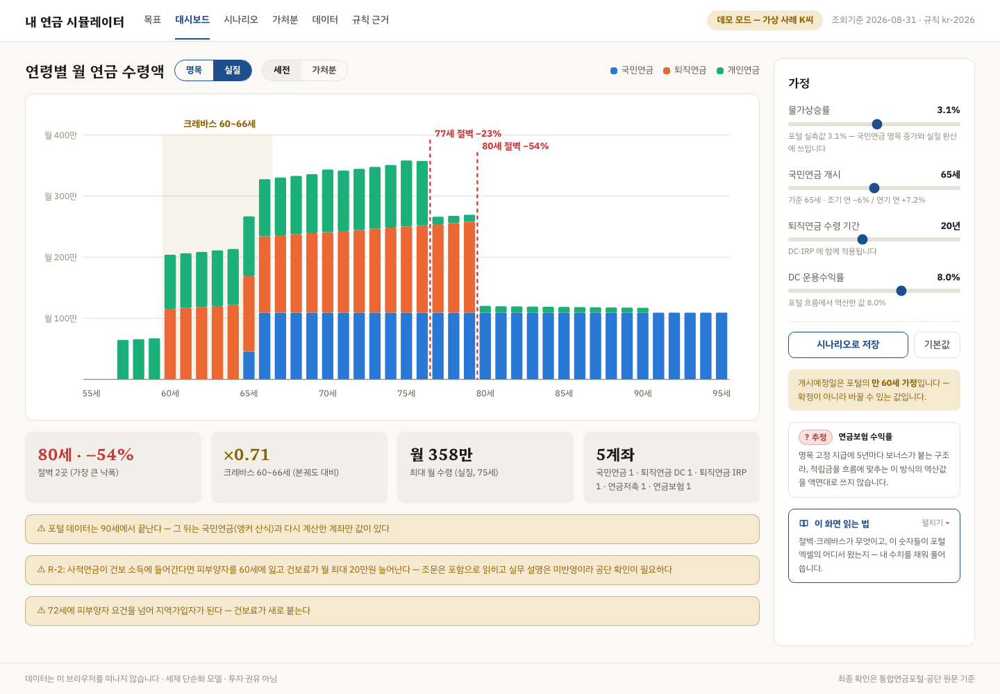
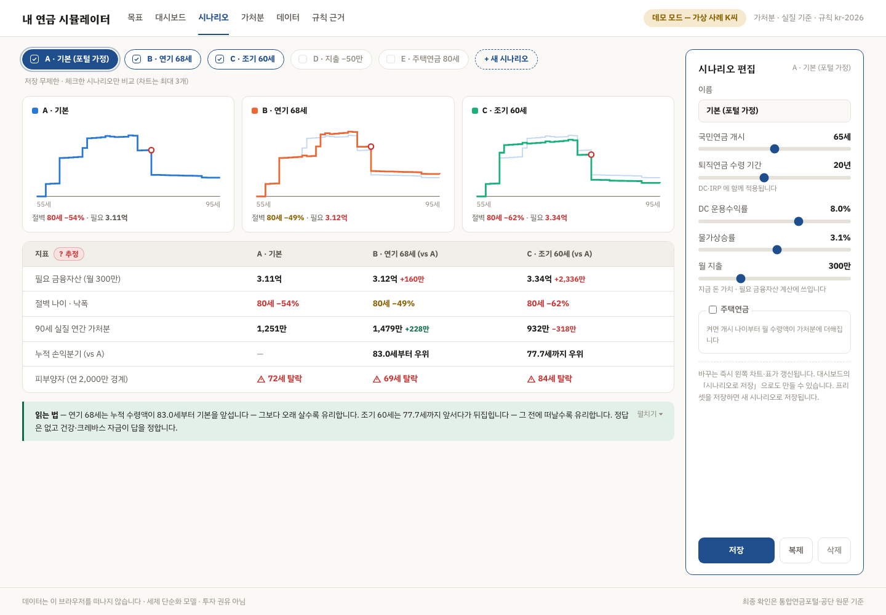
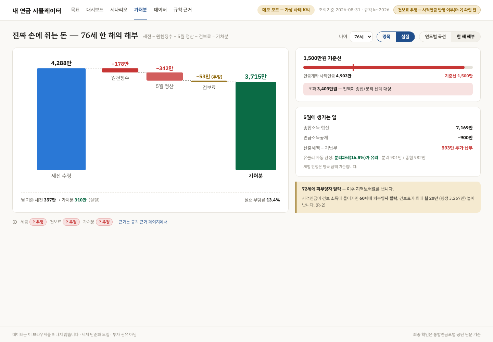
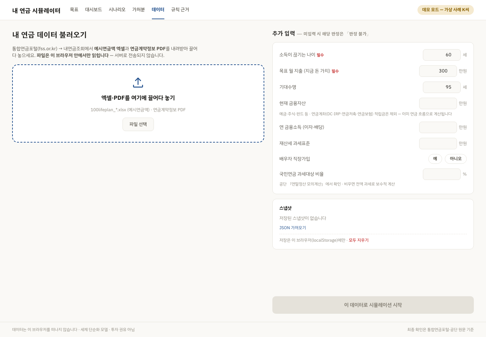
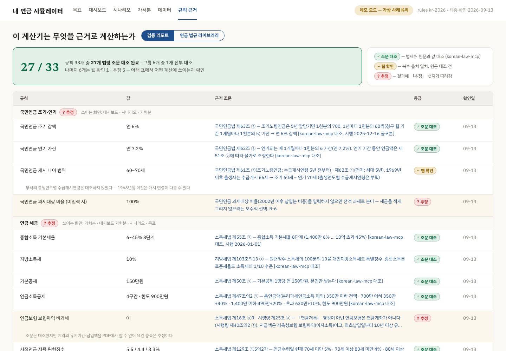

# My Pension Planner

**English** · [한국어](README_KO.md)

A retirement pension simulator built on top of the Korean **Integrated Pension Portal** (통합연금포털) export.
Import your portal Excel and contract PDF, then compare scenarios side by side, see real (inflation-adjusted) values, taxes, national health insurance premiums, disposable income, and warnings for income "cliffs" and "crevasses".

**Your data never leaves the browser.** There is no server, no database and no analytics. The only optional network call is a law search you enable with your own API key.

- Live demo: **https://my-pension-planner.vercel.app** (opens with a synthetic sample person, "K")
- Status: M0–M6 · 280+ tests · rules verified against current statutes

> Not investment advice. Simplified tax model. Always confirm with the portal, the National Pension Service and the National Health Insurance Service.

## Why

The portal shows expected pension payouts by age, but those numbers are one scenario with fixed assumptions (3.1% inflation, start at 60, product-specific returns). You cannot compare assumptions side by side, and it shows nothing about real value, tax, health insurance, or the years when income suddenly drops.

| Portal can't | This app |
|---|---|
| Compare scenarios | Up to 3 scenarios side by side with a metrics table and cumulative breakeven age |
| Show real value | Nominal / real toggle (base year = query date) |
| Model withdrawal strategy | National pension start age 60–70, retirement payout period, returns, housing pension |
| Include tax and health insurance | Withdrawal order, low rates, the ₩15M threshold (comprehensive vs 16.5% separate), withdrawal limits, dependent status and regional premiums |
| Warn about gaps | Cliffs (≥20% year-over-year drop) and the crevasse between retirement and full income |

## Screenshots

All screenshots use the synthetic demo person "K".

| Goal | Dashboard |
|---|---|
|  |  |
| **Scenarios** | **Disposable income** |
|  |  |
| **Data import** | **Rules & law library** |
|  |  |

## Features

- **Goal mode** – "How much do you want to spend per month?" → required financial assets at retirement, gap, depletion age.
- **Dashboard** – Stacked monthly payouts by age (national / retirement / private), nominal vs real, gross vs disposable, cliff and crevasse markers, assumption sliders, "how to read this screen".
- **Scenarios** – Presets (portal baseline, delay, early, spending cut, housing pension) and saved scenarios; sparklines, required assets, worst cliff, real disposable income at 90, cumulative breakeven, dependent-loss age.
- **Disposable income** – One year broken down: gross → withholding → May settlement → health premium → disposable; ₩15M threshold gauge with how many payout years would cross it.
- **Data** – Drag-and-drop portal Excel and contract PDF (parsed in the browser), extra inputs, per-account tax source composition, snapshots with JSON export/import and year-over-year comparison.
- **Rules & law library** – Every tax/insurance rule with value, legal citation, verification grade and check date; statute excerpts by topic; optional law search.
- **Calculator MCP** – The same engine as an MCP server for Claude Desktop (no personal data stored).

### How numbers are graded

| Grade | Meaning |
|---|---|
| ✓ Verified | Value checked against the current statute text (via [korean-law-mcp](https://github.com/chrisryugj/korean-law-mcp)) |
| ~ Web | Multiple sources agree, statute not yet checked |
| ? Estimated | Assumption or unresolved interpretation — results carry an "estimated" badge |

Currently 27 of 33 rules are verified. Open item: whether private pension income counts toward health insurance income (the statute text suggests yes, practice says no) — the app computes both and shows the difference.

## Tech stack

| Layer | Choice |
|---|---|
| Web | Next.js 16 (static export) · TypeScript strict · Tailwind CSS 4 |
| Engine | Pure TypeScript (`src/engine/`), no dependencies — shared by web and MCP |
| Importers | SheetJS (`xlsx`) · `pdfjs-dist`, browser only |
| Charts | Hand-written SVG |
| Tests | Vitest · Testing Library |
| MCP | `@modelcontextprotocol/sdk` (stdio) · zod |
| Hosting | Vercel (static, security headers with CSP `connect-src 'self' https://www.law.go.kr`) |

## Getting started

Requires Node.js 20.9+.

```bash
git clone https://github.com/daehyub71/my-pension-planner.git
cd my-pension-planner
npm install
npm run dev          # http://localhost:3000 — starts in demo mode
```

Get your own files from the portal (fss.or.kr → 내연금조회): the **예시연금액 Excel** and the **연금계약정보 PDF**, then drop them on the **Data** screen.

```bash
npm run lint
npm test             # real-data tests are skipped unless data/private/ exists
npm run build        # static export to out/ + network-call check
```

### Optional: law search key

The law library search can call the Korea Ministry of Government Legislation Open API with your own key ([open.law.go.kr](https://open.law.go.kr)). Register it on the Rules screen (stored in your browser only). During local development you can instead put `LAW_OC=your-key` in `.env.local`; it is injected **only by `next dev`**, never into production builds.

## Calculator MCP (Claude Desktop)

```bash
cd mcp
npm install
npm run build
npm run smoke        # starts the server and calls simulate / rules
```

Add to `claude_desktop_config.json` (use absolute paths), then fully restart Claude Desktop:

```json
{
  "mcpServers": {
    "my-pension-planner": {
      "command": "/absolute/path/to/node",
      "args": ["/absolute/path/to/my-pension-planner/mcp/dist/mcp/src/server.js"]
    }
  }
}
```

Tools:

- `simulate` – accounts + inputs (or `useDemo: true`) → yearly gross, real, tax, health premium, disposable; cliffs, crevasse, warnings, grades.
- `rules` – rule list, filterable by `grade` or id `prefix`.

Try: *"Use my-pension-planner to run a demo pension simulation and compare starting the national pension at 65 vs 68."*

## Project structure

```
app/                 6 screens (goal, dashboard, scenarios, disposable, data, rules)
components/          charts and screen pieces
src/engine/          pure TS engine: portal reproduction, projection, tax, health, goal, metrics
src/importers/       portal Excel / contract PDF parsers
src/store/           localStorage snapshots, scenarios, shared assumptions
src/lawSearch.ts     the only module allowed to use the network (opt-in law search)
rules/kr-2026.json   tax & insurance rules with citations and grades
content/law/         statute excerpts collected at build time (scripts/collect_law.mjs)
mcp/                 calculator MCP server
tests/               engine, importer, component, MCP contract tests + synthetic fixtures
docs/                SPEC · PLAN · DESIGN · TASKS
```

## Privacy

- Files are parsed in the browser; snapshots live in `localStorage`.
- Build-time check (`scripts/check_no_fetch.mjs`) fails if any network API appears outside `src/lawSearch.ts` or unknown hosts appear in the bundle.
- Real personal data is git-ignored (`data/private/`) and blocked by commit and push hooks.

## License

No license has been chosen yet; all rights reserved by the author.
